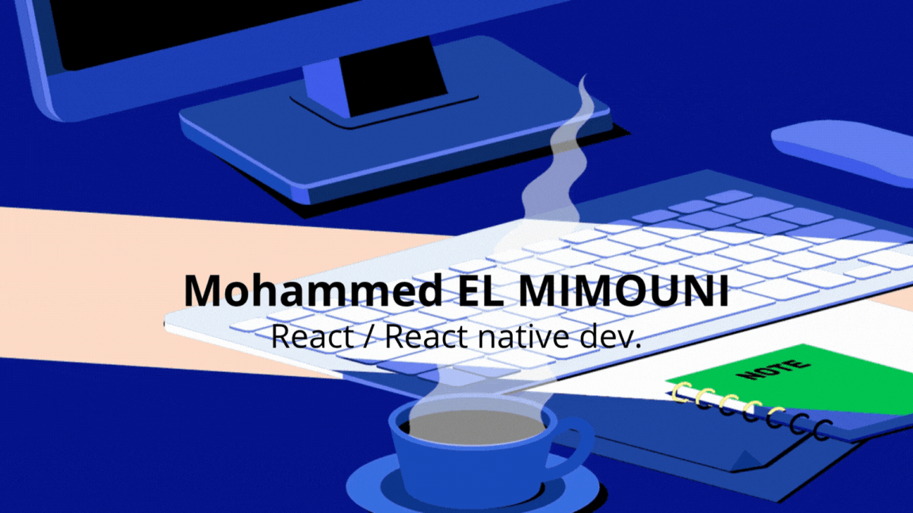

<h3 align="center">Skills</h3>

    

# Certificates

## Coursera Certificates

- **React Native Meta Certificate**: [PDF Certificate Link](https://www.coursera.org/account/accomplishments/verify/4NPIK0DP9XFX)

  

<h3 align="center">Socials</h3>

<a href="https://www.linkedin.com/in/mohammed-el-mimouni-99b722191" target="_blank" rel="noreferrer"> <picture> <source media="(prefers-color-scheme: dark)" srcset="https://raw.githubusercontent.com/danielcranney/readme-generator/main/public/icons/socials/linkedin-dark.svg" /> <source media="(prefers-color-scheme: light)" srcset="https://raw.githubusercontent.com/danielcranney/readme-generator/main/public/icons/socials/linkedin.svg" />  </picture></a>

<h3 align="center">My GitHub Stats</h3>

  

  

